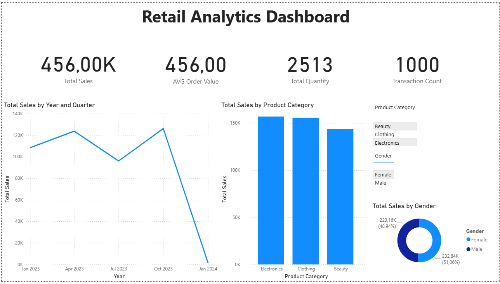
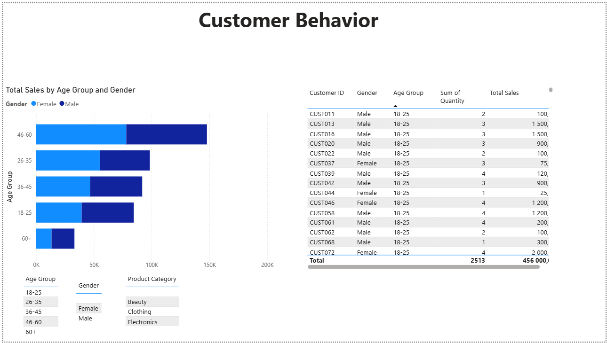
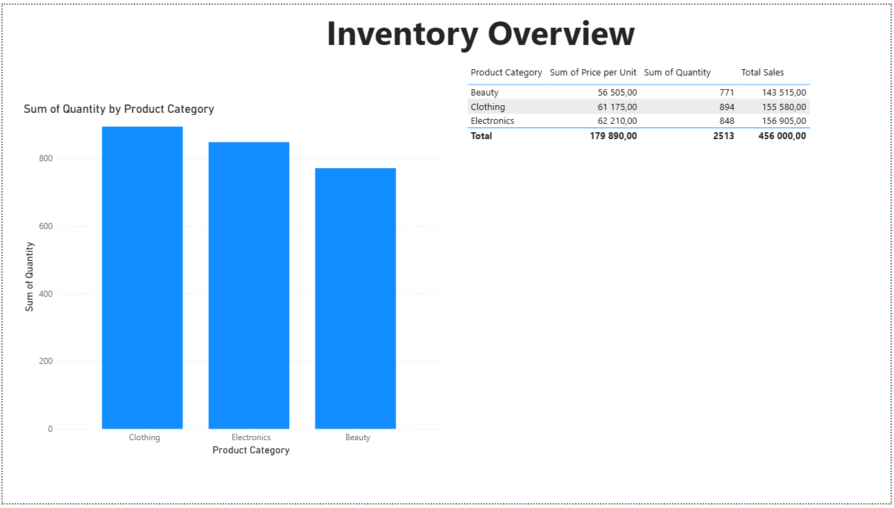

# 🛒 Retail Analytics Dashboard (Power BI)

This repository contains a **Retail Analytics Dashboard** built in **Microsoft Power BI**.  
The dashboard provides insights into sales performance, customer behavior, and product trends to help retailers make data-driven decisions.

---

## Features

- **Sales Overview**: Total revenue, profit, and units sold by category and region.
- **Customer Insights**: Customer segmentation and purchase patterns.
- **Product Analysis**: Best-performing and underperforming products.
- **Time Trends**: Sales trends by month, quarter, and year.
- **Interactive Filters**: Drill down by region, product, and customer type.

## Project structure
- Retail-Analytics-Dashboard/
- ├── Retail_Analytics_Dashboard.pbix 
- ├── data/ 
- │ └── retail_sales_dataset.csv
- ├── docs/ # Documentation & screenshots
- │ └── dashboard_preview.png
- └── README.md

## Tools & Technologies
- Microsoft Power BI (for data modeling & visualization)
- Power Query (M language) for data transformation
- DAX (Data Analysis Expressions) for measures & calculated columns
- Sample Retail Dataset (CSV/Excel)

---
## Insights gained
- Identified top 5 products by revenue.
- Discovered sales seasonality across different regions.
- Compared profit margins across categories.
- Monitored customer contributions to revenue.

## Dashboard preview
### Sales Overview
 

### Customer Insights
 

### Inventory Overview

